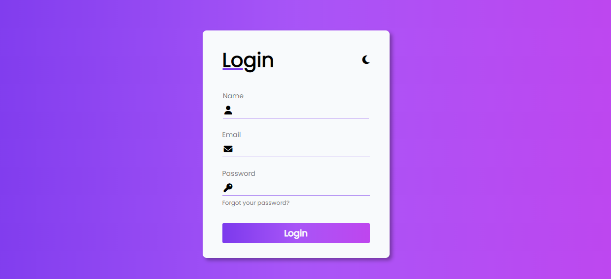

<h1 align="center">Formulário Login</h1>

  

## 📁 Sobre o Projeto

Exercício feito para praticar meus conhecimentos com HTML, CSS e JavaScript, foi inspirado em um projeto existente.

##

## 🚀 Tecnologias Utilizadas

- HTML
- CSS
- JavaScript
